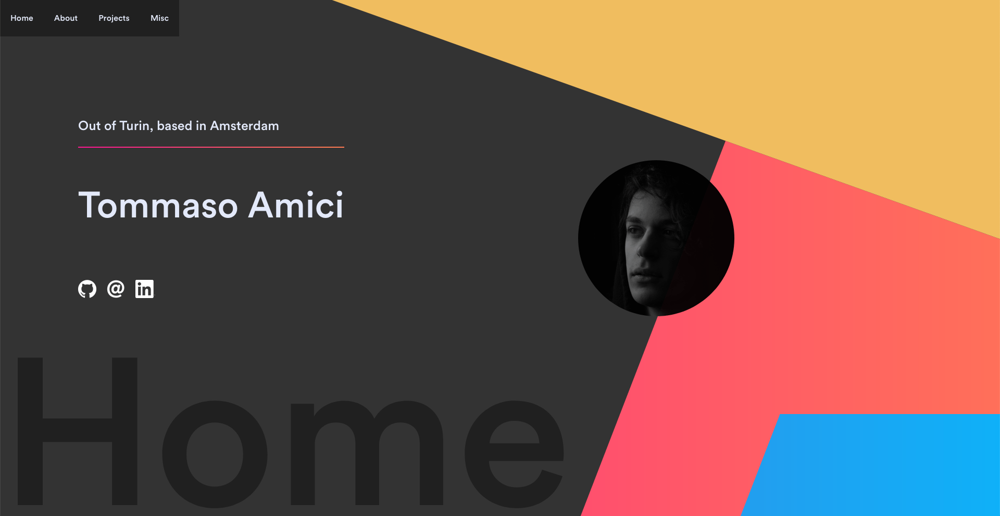
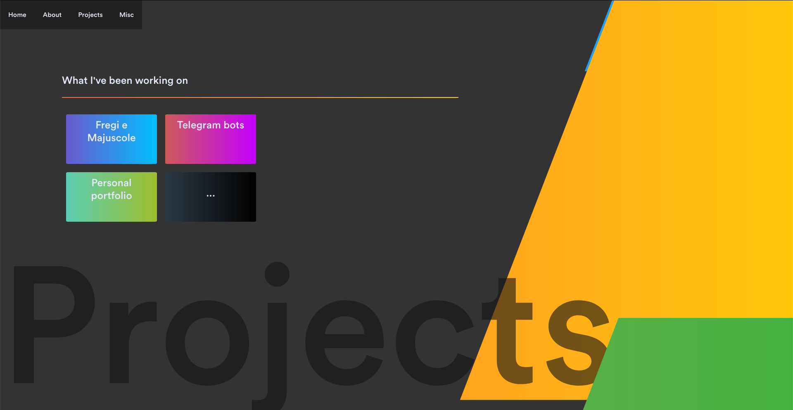

This very website you're currently on. Open source on [Github](https://github.com/TommasoAmici/personal-website).

- React for the frontend
- GatsbyJS as a semi-CMS
- `react-spring` for the animations
- No CSS frameworks
- Deployed on [Netlify](https://www.netlify.com/)

Screenshots

