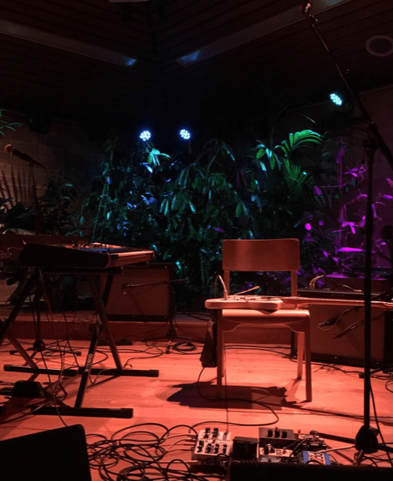

I'd been at Paradiso Noord before, but I went to see Haley Bonar and she played the Tuinzaal (i.e. the "garden room"). This is a great smaller venue: cozy, good lighting, good sound.

I recommend checking it out if you can grab tickets. Also recommend Haley.

<iframe allow="autoplay *; encrypted-media *;" frameborder="0" height="450" style="width:100%;max-width:660px;overflow:hidden;background:transparent;" sandbox="allow-forms allow-popups allow-same-origin allow-scripts allow-storage-access-by-user-activation allow-top-navigation-by-user-activation" src="https://embed.music.apple.com/it/album/pleasureland/1420656130?l=en"></iframe>
